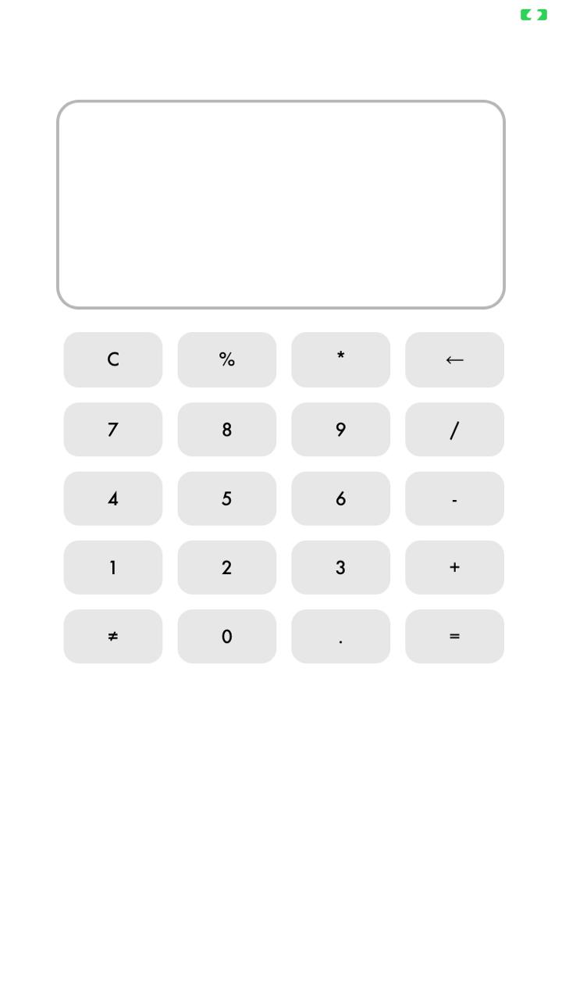
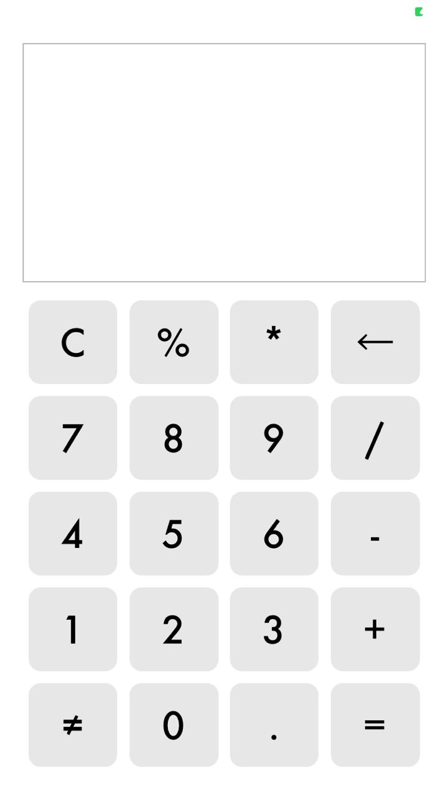
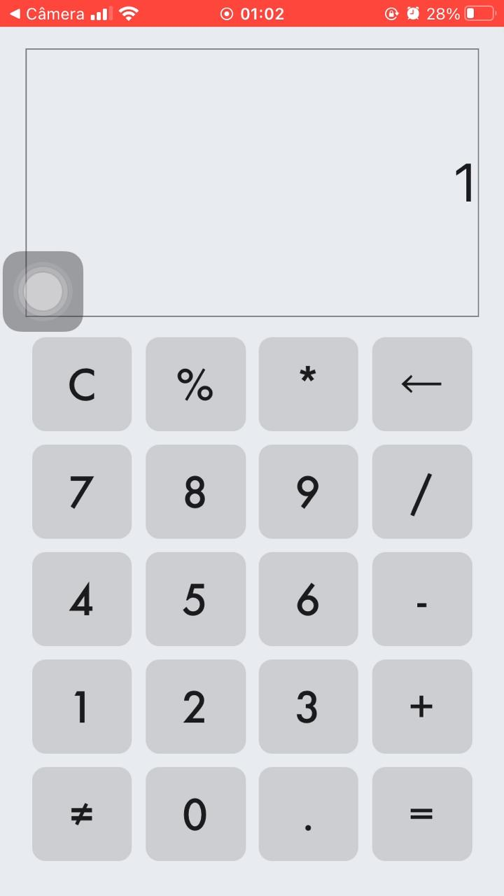
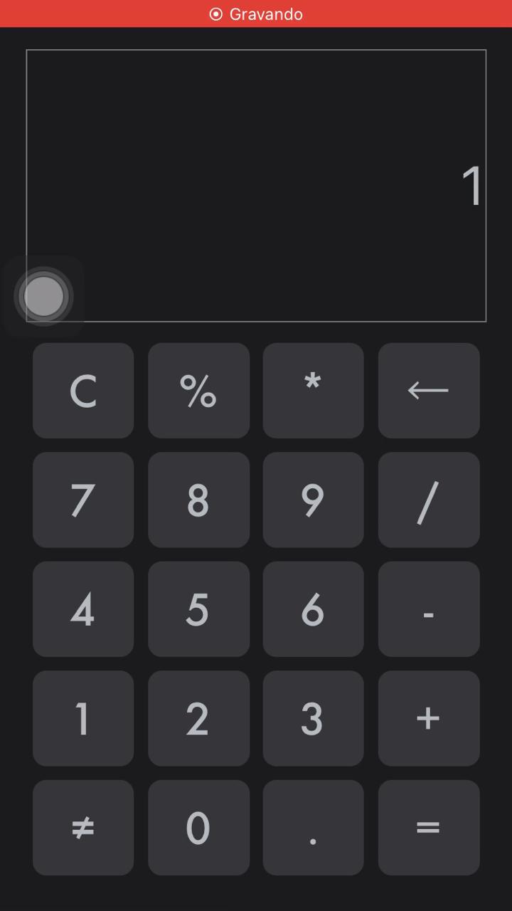

# Dynamic Calc

##   Dynamic calculator developed using React Native with Expo.

Content Index
=================
- [About](#about)
- [Commit Explanations](#commit-explanations)

###  About
  Dynamic calculator designed for study using React Native technology.

###  Commit Explanations

<table>
  <thead>
    <tr>
      <th>
        <h4> Creating Calculator Layout </h4>
      </th>
      <th>
        <h4> Changing The Layout Style Of The Calculator </h4>
      </th>
    </tr>
  </thead>

  <tbody>
    <tr>
      <td>
        
      </td>
      <td>
        
      </td>
    </tr>
  </tbody>
</table>

- #### Automatic Theme Creation

<table>
  <thead>
    <tr>
      <th> Light </th>
      <th> Dark </th>
    </tr>
  </thead>
  <tr>
    <td>
      
    </td>
    <td>
      
    </td>
  <tr>
</table>

---

### --- :construction: Under Construction :construction: ---
